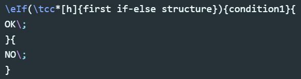
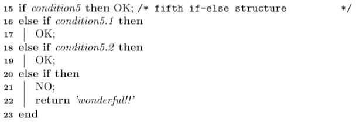
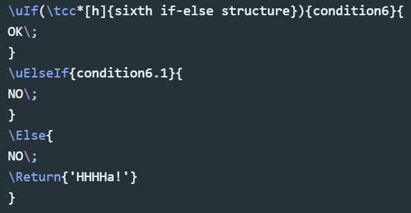
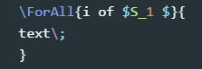

# 目录
<!-- TOC depthFrom:1 depthTo:6 withLinks:1 updateOnSave:1 orderedList:0 -->

- [目录](#目录)
- [1. algorithm 2e  宏包学习](#font-color9c66801-algorithm-2e-宏包学习font)
- [2. How to use it?](#font-color9c66802-how-to-use-itfont)
- [3. Here is a quick example](#font-color9c66803-here-is-a-quick-examplefont)
	- [第一个例子的解析](#font-color94a657第一个例子的解析font)
- [4. 第二个 example](#font-color9c66804-第二个-examplefont)
	- [第二个例子的解析](#font-color-94a657第二个例子的解析font)
- [5. If-else的宏命令](#font-color9c66805-if-else的宏命令font)
	- [If 和Else宏命令的种类如下表所示：](#font-color94a657if-和else宏命令的种类如下表所示font)
- [6. For循环的宏命令](#font-color9c66806-for循环的宏命令font)
	- [For循环宏命令的种类如下表所示：](#font-color94a657for循环宏命令的种类如下表所示font)
- [7. While循环的宏命令](#font-color9c66807-while循环的宏命令font)
	- [while循环命令的使用：](#font-color94a657while循环命令的使用font)
- [8. 注释宏命令](#font-color9c66808-注释宏命令font)
	- [`\tcp{}` 与`\tcc{}`的不同：](#font-color94a657tcp-与tcc的不同font)
	- [`\tcp{}` 与`\tcp*[options]{}`的不同：](#font-color94a657tcp-与tcpoptions的不同font)
- [9. 自定义函数Function](#font-color9c66809-自定义函数functionfont)
	- [`\SetKwFunction{KwFn}{Fn}`命令](#font-color94a657setkwfunctionkwfnfn命令font)
	- [`\SetKwProg{Prog}{Title}{is}{end}`命令](#font-color94a657setkwprogprogtitleisend命令font)
	- [适应不同需求的函数样式](#font-color94a657适应不同需求的函数样式font)
	- [以`\SetKwProg`单独创建函数](#font-color94a657以setkwprog单独创建函数font)
	- [当你在算法中只想引用一个函数名时](#font-color94a657当你在算法中只想引用一个函数名时font)
- [10.算法的输入与输出 ](#font-color9c668010算法的输入与输出-font)
	- [ `Input - Ouput`类型的宏命令](#font-color94a657-input-ouput类型的宏命令font)
	- [  `Data - Result`类型的宏命令](#font-color94a657-data-result类型的宏命令font)
- [11.构造自己的关键词的基本方法 ](#font-color9c668011构造自己的关键词的基本方法-font)
	- [ `\SetKw{Kw}{text}` 示例](#font-color94a657-setkwkwtext-示例font)
	- [ `\SetKwHangingKw{HData}{Data}` 示例](#font-color94a657-setkwhangingkwhdatadata-示例font)
	- [`\SetKwData{Left}{left}` 示例](#font-color94a657setkwdataleftleft-示例font)
	- [`\SetKwArray{KwAarray}{array}` 示例](#font-color94a657setkwarraykwaarrayarray-示例font)
- [12.Algorithm2e宏包中基本关键词和基本块结构 ](#font-color9c668012algorithm2e宏包中基本关键词和基本块结构-font)
- [13.在Algorithm2e宏包中使用中文 ](#font-color9c668013在algorithm2e宏包中使用中文-font)
- [14.算法标题 ](#font-color9c668014算法标题-font)
	- [`\caption{}`命令](#caption命令)
	- [`ruled`options](#ruledoptions)
	- [修改算法的编号](#修改算法的编号)
	- [修改算法的关键字](#修改算法的关键字)
- [未完待续... ](#font-color9c6680未完待续-font)

<!-- /TOC -->

***
---

# 1. algorithm 2e  宏包学习

---
# 2. How to use it?
- 在之前`\begin{document}`，需要加载algorithm 2e包`usepackage[options]{algorithm2e}`,以及加入这两行
 `\def\SetClass{article}`,  `\documentclass{\SetClass}`，

- `[options]`选项有`ruled`,`linesnumbered`,`boxed`:

    - `ruled`:是让标题显示在上面，否则算法的标题则在下面。

    - `linesnumbered`:让算法中显示行号。

    - `boxed`:让算法排版时插入在一个盒子里
---
# 3. Here is a quick example
对应的tex文件 `E:\markdown笔记\Algrothem 2e 宏包学习\tex文件\2e_test1.tex`

## 第一个例子的解析
Very important ！！！
- each line MUST end with `\;`，且会自动换行，如果不想在每行末尾有`;`，可以添加命令`\DontPrintSemicolon`  ;`\PrintSemicolon`命令会在每行末尾打印出`;`

- only those with a macro beginning a block should not end with `\;`  【macro--> 宏】

- 你也可以用`\;`命令，在数学模块中，创造一小块空间

- `caption{}`选项应该放在末尾；`caption{}`里面的内容就是你的算法名称
- 加入`\SetAlgoNoLine`命令，可以让算法中没有竖线，如下图所示：

   
- 加入`\SetAlgoLined`命令，可以让算法中有竖线，如下图所示：

   
- 加入命令`\SetAlgoVlined`，可以让算法中有折线，如下图所示：

   

注意比较`\SetAlgoNoLine`，`\SetAlgoLined`，`\SetAlgoVlined`这三个命令，只有最后一个命令，会使得if-else,或while等block，没有`end`作为结尾

---
- While 语句：使用命令`While{条件}{语句}`，如下图所示：

  

- if-else语句：使用命令`eIf{条件}{if 下的语句}{else下的语句}`，如下图所示：

   
- while语句中内嵌if-else语句，的格式如下图所示：

  

---
# 4. 第二个 example
对应的tex文件 `E:\markdown笔记\Algrothem 2e 宏包学习\tex文件\2e_test2.tex`

## 第二个例子的解析
- 如何在算法中加注释？
  - 注释语法1为 `\tcp[options]{}`  注释的样式为：`//`，如下图所示

    

  - 注释语法2为 `、tcc[options]{}`  注释的样式为：`/*`，如下图所示

     
  - 在if句使用注释时, `\If(tcc{注释}){条件}`

- 添加空白行命令 `\BlankLine`，将该命令添加在需要加入空白行的地方

- `\emph{}`，该命令表示斜体

- 普通的语句直接写，如果需要换行需要在语句最后加入`\`符号

- `\IncMargin{1em}`命令：使得行号不向外突出

---

# 5. If-else的宏命令
## If 和Else宏命令的种类如下表所示：
| IF 	| Else 	|
|:--:	|:----:	|
| `\If{condition}{then block}`   	|   `Else{else block }`   	|
|   `\uIf{condition}{then block without end }`   	|    `uElse{else block without end }`   	|
|    `\lIf{condition}{then's line text }` 	|  `lElse{else's line text}`     	|
|    `\ElseIf{condition}{elseif block }` 	|      	|
|    `\uElseIf{condition}{elseif block without end }` 	|      	|
|    `\lElseIf{condition}{elseif's line text  }`	|      	|
|    `\eIf{condition}{then block }{else block  }` 	|      	|
|    `\leIf{condition}{then block }{else block  }` 	|      	|

If-Else的嵌套使用：

---
- `\eIf(comment){condition}{then block }{else block  }` ：

	

	

---
-  `\If{condition}{then block}`   :

	

	

---
- `\lIf{condition}{then's line text }` :

	

	

---
- `\leIf{condition}{then block }{else block  }`  :

	

	

---
- 多个If-Else结构嵌套使用：

	

	

---
- 多个If-Else结构嵌套使用2：

	

	

---
对应的tex文件示例：`E:\markdown笔记\Algrothem 2e 宏包学习\tex文件\IF_Else.tex`

---

# 6. For循环的宏命令
## For循环宏命令的种类如下表所示：
|for loop 	|
|:----:	|
| `\For{loop's condition}{For's text}`	|
| `\For{loop's condition}{For's text (comment)}`	|
| `\lFor{loop's condition}{For's text}`	|
| `\lFor*{loop's condition}{For's text}`	|
| `\ForAll{loop's condition}{For's text}`	|
| `\ForEach{loop's condition}{For's text}`	|

For循环的使用：

---
- `\For{loop's condition}{For's text}` :

	

	

---
- `\lFor{loop's condition}{For's text}` :

	

	

---
- `\lFor*{loop's condition}{For's text}` :

	 

	 

---
- `\ForAll{loop's condition}{For's text}`：

	 

   

---
- `\ForEach{loop's condition}{For's text}` :

	

	

---
- 两个For循环嵌套：

	

	

---
对应的tex文件示例：`E:\markdown笔记\Algrothem 2e 宏包学习\tex文件\For_loop.tex`

---

# 7. While循环的宏命令
- algorithm2e 中最常用的while循环命令为：`\While{}{}`
- algorithm2e 中没有`do-while`结构的宏命令，但可以自定义

## while循环命令的使用：
- `\While{}{}` ：

	

	

- While 循环与If-Else结构嵌套：

	

	

- While , If-else and For 嵌套使用：

	

	

---
对应的tex文件示例：`E:\markdown笔记\Algrothem 2e 宏包学习\tex文件\While.tex`

---

# 8. 注释宏命令
在Algorithm2e宏包中，注释命令的种类有如下几种：

| tcc 	| tcp 	|
|:---:	|:---:	|
|   `\tcc{}`  	|   `\tcp{}`   	|
|   `\tcc*[l]{}`   	|   `\tcp*[l]{}`   	|
|   `\tcc*[r]{}`   	|    `\tcp*[r]{}`  	|
|   `\tcc*[h]{}`   	|    `\tcp*[h]{}`  	|
|   `\tcc*[f]{}`   	|    `\tcp*[f]{}`  	|

## `\tcp{}` 与`\tcc{}`的不同：
`\tcp`的注释样式为：`//`，如下图所示：

`\tcc`的注释样式为：`/*  */`，如下图所示：

## `\tcp{}` 与`\tcp*[options]{}`的不同：
-  `\tcc{}`:  注释语句单独一行，注释语句前无`;`，行末无`;`

	
	

-  `\tcc*[l]{}`:注释语句左靠齐，注释语句前有`;`

	
	

-  `\tcc*[r]{}`:注释语句右靠齐，注释语句前有`;`

	
	

-  `\tcc*[h]{}`:注释语句左靠齐，注释语句前无`;`，行末无`;`

	
	

-  `\tcc*[f]{}`:注释语句右靠齐，注释语句前无`;`，行末无`;`

	
	

`\tcp`命令的options与上述相同

- **Please note that：**

	- 当与IF-Else,While等 block 嵌套使用时，只能嵌套 `\tcc*[h]{}`或`\tcc*[f]{}`命令
	- 一个语句单独一行时，只能使用 `\tcc{}`命令
	- 需要在一条普通的语句后面紧接注释时，请使用 `\tcc*[l]{}`或 `\tcc*[r]{}`命令

# 9. 自定义函数Function

## `\SetKwFunction{KwFn}{Fn}`命令
`\SetKwFunction{KwFn}{Fn}`主要用来定义一个函数名称

`KwFn`为tex内定义的关键字，{Fn}为pdf内真实显示的关键字。其中，`KwFn`关键字的名称可以随意命名，{Fn}为你pdf文档中需要的函数名称，一般为Function或Def。

## `\SetKwProg{Prog}{Title}{is}{end}`命令
 `\SetKwProg{Prog}{Title}{is}{end}`用来编写函数的具体实现

 `Prog`为关键字，`Title`为你pdf文档中的函数标签。
 `is`是pdf文档中，函数名字后面所接标签，`end`表示该函数以`end`结尾

 ## 自定义函数的例子

 ---
 - 定义一个`Function`函数
 	- step1. 定义该函数的一个函数名称：
	
	`Fsum`为接下来写tex程序需要调用的关键字，而`Sum`为PDF文档中所出现的函数名。

	- step2. 实现具体的函数功能：
	
	- 完整的定义一个函数的代码如下：
	
	

---
- 定义一个`Def`函数
	- step1. 定义该函数的一个函数名称：
	

	- step2. 实现具体的函数功能：
	

	- 完整的定义一个函数的代码如下：
	
	

同理，如果想定义一个标签为`Main`的函数，只需要修改`\SetKwProg{Prog}{Title}{is}{end}`命令的第二个中括号的内容为`Main`
即如下所示：

## 适应不同需求的函数样式
- 无`end`结尾的Function
	- 代码：

		
	- 效果：

		
	- Note!  ： `\SetKwProg{Prog}{Title}{is}{}`命令的第四个中括号空着就行.
---

- 以`end`结尾的Function
	- 代码：

	

	- 效果：

	

	- Note!  ：这里可以灵活改变，若需要以`End`结尾,则命令 `\SetKwProg{Prog}{Title}{is}{End}`的第四个中括号内容为`End`.
---

- 以`return`结尾的Function
	- 代码：

	

	- 效果：

	

---

	- Note!  ：首先，return在Algorithm2e中的关键字为`\KwRet`。其次，若命令 `\SetKwProg{Prog}{Title}{is}{\KwRet{}}`的第四个中括号的内容为`\KwRet` 且函数体内部也有`\KwRet`关键字，则两个return都会显示。

	
	

---

- Function is 样式
	- 代码：

	

	- 效果：

	

---

- Function ：样式
	- 代码：

	

	- 效果：

	

---

## 以`\SetKwProg`单独创建函数
- 代码：

- 效果：

---

-  Note!  ：不建议在函数体内部打字return,这样的return不会加粗，应该使用algorithm2e的关键字`\KwRet`。其次，这样创建的函数的函数名称是斜体的，虽然这种方法更简便，不需要用到`\SetKwFunction`命令，请自行选择使用哪种方法创建函数

## 当你在算法中只想引用一个函数名时

当你在算法中只想引用一个函数名，而不用实现该函数的具体函数体时，也可以采用`\SetKwFunction`命令来单独创建一个函数名称。
- 代码：

- 效果：

---

本节中所有例子对应的tex文件为：`E:\markdown笔记\Algrothem 2e 宏包学习\tex文件\Function\Function.tex`

---

# 10.算法的输入与输出 
在文献中常见的输入输出有两种：
- 第一种：`Input - Ouput`类型，如下图所示：
	- 效果图：
	
	- 代码：

		

- 第二种： `Data - Result`类型，如下图所示：
	- 效果图：
	
	- 代码：
		
---

##   `Input - Ouput`类型的宏命令
`Input - Ouput`类型涉及的宏命令主要有三个：
- `\SetKwInput{KwInput}{Input}`
- `\KwInput{input text}`
- `\KwOutput{output text}`

`\SetKwInput{KwInput}{Input}`的第一个中括号中的内容`KwInput`主要为写代码中所使用的宏命令；第二个中括号的内容`Input`为pdf文档中，你想要的input标签.其中，第一个中括号中的内容可以随意。定制个性化的输入输出，见下面的例子：

---
- 如果你想要小写input
	- 代码：

		

	- 效果图：

		

---
- 如果你想要大写的input
	 - 代码：

	 	

	 - 效果图：

	 	

---

`\KwInput{input text}`主要实现的是，实现你算法中的输入内容，中括号中的内容就是你算法的输入内容

`\KwOutput{output text}`主要实现的是，实现你算法中的输出内容，中括号中的内容就是你算法的输出内容

Note!  ：对于`Input - Ouput`类型的输入输出，必须先通过`\SetKwInput{KwInput}{Input}`命令，指定input的标签，再使用`\KwInput{input text}`和`\KwOutput{output text}`命令实现你算法的输入输出内容

一套完整的构造`Input - Output`的代码：

##    `Data - Result`类型的宏命令
 `Data - Result`类型的宏命令相比于`Input - Ouput`类型的宏命令更简单。

 构造算法的Data,只需要`\KwData{ data text}`命令；

 构造算法的Result，只需要`\KwResult{result text}`命令

 一套完整的构造`Input - Output`的代码：

本节中所有例子对应的tex文件为：`E:\markdown笔记\Algrothem 2e 宏包学习\tex文件\Input_and_Ouput\InputAndOuput.tex`

# 11.构造自己的关键词的基本方法 

此处不再详细讲解，因为基本上用不到

在Algorithm2e宏包中，构造自己的关键词的方法有一下几种：
| Macro command 	| definition	|
|:---:	|:---:	|
| `\SetKw{Kw}{text}`	|which define a keyword `text`|
| `\SetKwHangingKw{HData}{Data}`	|which define a hanging keyword `Data`	|
| `\SetKwData{Left}{left}`	| which define a data text `left`.	|
| `\SetKwArray{KwAarray}{array}`	|`which define an array keywords`	|

##  `\SetKw{Kw}{text}` 示例
- 代码：

	

- 效果：

	

##  `\SetKwHangingKw{HData}{Data}` 示例
- 代码：

	

- 效果：

	

##  `\SetKwData{Left}{left}` 示例
- 代码：

	

- 效果：

	

##  `\SetKwArray{KwAarray}{array}` 示例
- 代码：

	

- 效果：

	

本节中所有例子对应的tex文件为：`E:\markdown笔记\Algrothem 2e 宏包学习\tex文件\Keywords\keywords.tex`

#  12.Algorithm2e宏包中基本关键词和基本块结构 

---

- 关键词：`to`
	- 代码：

		

		- 效果：

			

---

- 关键词：`return`
	- 代码：

		

		- 效果：

			

 Note!  ： 貌似`\KwRet{}`与`\Return{}`两者的效果一样

---

- 块结构：begin
	- 代码：

		

		- 效果：

			

本节中所有例子对应的tex文件为：`E:\markdown笔记\Algrothem 2e 宏包学习\tex文件\Basic_Kw\basicKw.tex`

# 13.在Algorithm2e宏包中使用中文 

在算法中输入中文，只需要在`\begin{document}`之前添加一个包即可：
`\usepackage[GBK]{ctex}  `

 Note!  ：如果出现乱码的情况，可以尝试把`[GBK]`换成`[UTF-8]`.

# 14.算法标题 
## `\caption{}`命令
`\caption{}`中括号内的内容即为，你的算法名称

## `ruled`options

在`\usepackage[linesnumbered,lined,ruled,boxed]{algorithm2e}`命令中，`ruled`表示算法的标题在算法的上方，当不加`ruled`时，默认算法的标题位于算法的下方。

两个例子如下所示：

- 代码：

- 效果：

- 代码：

- 效果：

## 修改算法的编号

修改算法的编号有两种方式
-  `\renewcommand{\thealgocf}{number}` ,`number`为修改的算法编号
-  `\SetAlgoRefName{number}`,`number`为修改的算法编号

## 修改算法的关键字

使用`\renewcommand{\algorithmcfname}{算法关键字}`命令修改算法的关键字

例子如下所示：
- 代码：

- 效果：

# 未完待续... 
